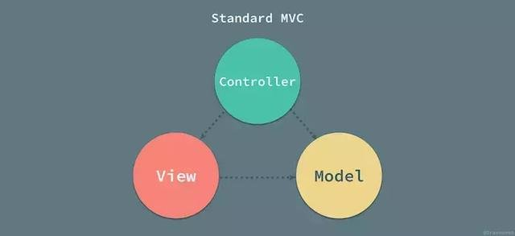
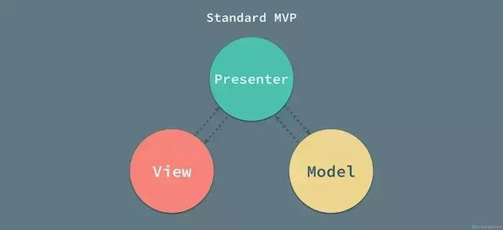
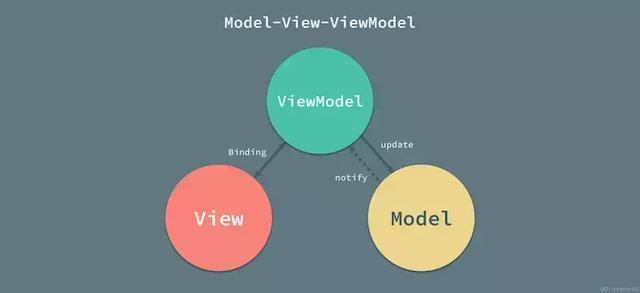
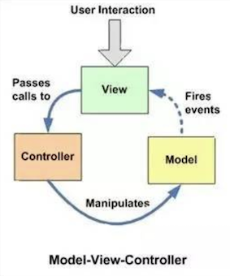
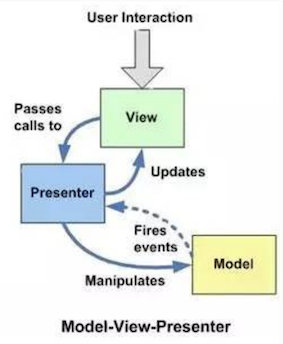
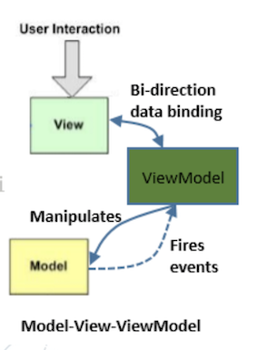

# 目錄
* 關於 MVVM
  * 1.什麼是 MVVM
  * 2.和 MVC、MVP 其它框架（jquery）的區別？哪些場景適合？
  * 3.為什麼要使用 MVVM
  * 4.常見的實現 MVVM 幾種方式

# 關於 MVVM

> ## 1. 什麼是 MVVM
#### **<回答1>**

MVVM 是 Model-View-ViewModel 的縮寫。MVVM 是一種設計思想，共分為 Model、View、ViewModel 三者：

* Model
  * 資料模型，資料和業務邏輯都在 Model 層中定義。
  * 管理資料來源如API和本地資料庫。
  * 管理所有的資料來源，例如API、資料庫和 SharedPreference，當ViewModel 來請求資料時從正確的來源取得資料並回傳。

* View
  * UI 檢視，負責資料的展示。
  * 顯示UI和接收使用者動作。
  * 是 Activity、Fragment 或 custom view，本身不做邏輯處理，當使用者跟 UI有互動時將指令傳給 ViewModel 處理，透過其獲得所需的資料並顯示。

* ViewModel
  * 負責監聽 Model 中資料的改變並且控制檢視的更新，處理使用者互動操作。
  * 從Model取得View所需的資料。
  * 接收View的指令並對Model請求資料，將取得的資料保存起來供View使用。

  Model 和 View 並無直接關聯，而是通過 ViewModel 來進行聯絡，Model 和 ViewModel 之間有著雙向資料繫結的聯絡。因此當 Model 中的資料改變時會觸發 View 層的重新整理，View 中由於使用者互動操作而改變的資料也會在 Model 中同步。
  
  這種模式實現了 Model 和 View 的資料自動同步，因此開發者只需要專注對資料的維護操作即可，而不需要自己操作 DOM。

#### **<回答2>**

MVVM 是 Model-View-ViewModel 的縮寫。MVVM 是一種設計思想。Model 層代表數據模型，也可以在 Model 中定義數據修改和操作的業務邏輯；View 代表 UI 組件，它負責將數據模型轉化成 UI 展現出來，ViewModel 是一個同步 View 和 Model 的對象。

在 MVVM 架構下，View 和 Model 之間並沒有直接的聯繫，而是通過 ViewModel 進行交互，Model 和 ViewModel 之間的交互是雙向的， 因此 View 數據的變化會同步到 Model 中，而 Model 數據的變化也會立即反應到 View 上。

ViewModel 通過雙向數據綁定把 View 層和 Model 層連接了起來，而 View 和 Model 之間的同步工作完全是自動的，無需人為干涉，因此開發者只需關注業務邏輯，不需要手動操作 DOM, 不需要關注數據狀態的同步問題，複雜的數據狀態維護完全由 MVVM 來統一管理。

#### **<回答3>**
MVVM，是 Model、View、ViewModel 三者的縮寫，它是一種程式的設計框架，是一種設計思路。不同的人實現 MVVM，所用的構成技術、實現以後的效能都是不一樣的。千萬不要覺得它有多深奧，他其實就是由一系列程式碼（或技術）構成的一個程式的底座。我們在良好底座上開發出來的程式穩定性更高，可擴充套件性更強。

下面我們挨個來來說 Model、View、ViewModel。

1. Model：資料提供。

    Model在程式中專門用於提供資料，不管是網路請求獲得的資料，還是資料庫獲得的資料，統統寫在Model裡。Model層獨立性相當強，它只用來提供資料，而不管資料是用來做什麼的。

2. View：檢視元素和檢視元素初始化。

    View 在 Android 中指代的就是我們常見的佈局檔案和 Activity 中的元素初始化部分。總之，所有一切我們在 Android 上肉眼能看見的東西都是 View。在 View 層裡，我只對 UI 做初始化，比如將 TextView 設定字型大小，為 Banner 控制元件設定滾動速度等等，這些大多可以直接在佈局檔案中完成。

3. ViewModel：

    操作業務資料，並將資料呈現在View上。

    ViewModel 根據業務需要，從 Model 層調取相關資料，然後更新 View 層相關元素。

> ## 2. 和 MVC、MVP 其它框架（jquery）的區別？哪些場景適合？
#### **<回答1>**

mvc 和 mvvm 其實區別並不大。都是一種設計思想。主要就是 mvc 中 Controller 演變成 mvvm 中的 viewModel。mvvm 主要解決了 mvc 中大量的 DOM 操作使頁面渲染性能降低，加載速度變慢，影響用戶體驗。和當 Model 頻繁發生變化，開發者需要主動更新到 View 。

#### **<回答2>**

* MVC（Model View Controller）
  
  
  
  * 原理

    當有用戶的行為觸發操作時，控制器（Controller）更新模型，並通知視圖（V）和模型（M）更新，這時視圖（V）就會向模型（M）請求新的數據，這就是標準MVC模式下 Model，View 和 Controller 之間的協作方式。

    * Model 層：模型（用於封裝業務邏輯相關的數據以及對數據的操縱）。

    * View 層：視圖（渲染圖形化介面，也就是所謂的UI介面）。

    * Controller 層：控制器（M 和 V 之間的連接器，主要處理業務邏輯，包括顯示數據，介面跳轉，管理頁面生命周期等）。
  
  * MVC 優點

    * 耦合性低，視圖層和業務層分離，這樣就允許更改視圖層代碼而不用重新編譯模型和控制器代碼。
      > > #### *[什麼是耦合性](https://ithelp.ithome.com.tw/articles/10203659 "耦合性")*
    
    * 重用性高。
    
    * 生命周期成本低。
    
    * MVC 使開發和維護用戶接口（User Interface, UI）的技術含量降低。
    
    * 可維護性高，分離視圖層和業務邏輯層也使得 WEB 應用更易於維護和修改部署快。
  
  * MVC 缺點
    
    * 不適合小型，中等規模的應用程式，花費大量時間將 MVC 應用到規模並不是很大的應用程式通常會得不償失。
    
    * 視圖與控制器間過於緊密連接，視圖與控制器是相互分離，但卻是聯繫緊密的部件，視圖沒有控制器的存在，其應用是很有限的，反之亦然，這樣就妨礙了他們的獨立重用。
    
    * 視圖對模型數據的低效率訪問，依據模型操作接口的不同，視圖可能需要多次調用才能獲得足夠的顯示數據。對未變化數據的不必要的頻繁訪問，也將損害操作性能。

* MVP（Model View Presenter）

  

  由 MVC 演變而來，它和 MVC 的相同之處在於：Controller / Presenter 都是負責業務邏輯，Model 管理數據，View 負責顯示。不過在 MVP 中 View 並不直接與 Model 交互，它們之間的通信是通過 Presenter（MVC 中的 Controller）來進行的，即使用 Presenter 對視圖和模型進行了解耦，讓它們彼此都對對方一無所知，溝通都通過 Presenter 進行。

  * 原理
    
    在 MVP 中，Presenter 可以理解為鬆散的控制器，其中包含了視圖的 UI 業務邏輯，所有從視圖發出的事件，都會通過代理給 Presenter 進行處理；同時，Presenter 也通過視圖暴露的接口與其進行通信。

    * Model層：模型（用於封裝業務邏輯相關的數據以及對數據的操縱）。
    
    * View層：視圖（渲染圖形化介面，也就是所謂的UI介面）。
    
    * Presenter層：控制器（M和V之間的連接器，主要處理業務邏輯，包括顯示數據，介面跳轉，管理頁面生命周期等）。
  
  * MVP 特點
    
    * M、V、P 之間雙向通信。
    
    * View 與 Model 不通信，都通過 Presenter 傳遞。Presenter 完全把 Model 和 View 進行了分離，主要的程序邏輯在 Presenter 裡實現。
    
    * View 非常薄，不部署任何業務邏輯，稱為「被動視圖」（Passive View），即沒有任何主動性，而 Presenter 非常厚，所有邏輯都部署在那裡。
    
    * Presenter 與具體的 View 是沒有直接關聯的，而是通過定義好的接口進行交互，從而使得在變更 View 時候可以保持 Presenter 的不變，這樣就可以重用。不僅如此，還可以編寫測試用的 View，模擬用戶的各種操作，從而實現對 Presenter 的測試–從而不需要使用自動化的測試工具。
  
  * MVP 優點

    * 模型與視圖完全分離，我們可以修改視圖而不影響模型。
    
    * 可以更高效地使用模型，因為所有的交互都發生在一個地方—— Presenter 內部。
    
    * 我們可以將一個 Presenter 用於多個視圖，而不需要改變 Presenter 的邏輯。這個特性非常的有用，因為視圖的變化總是比模型的變化頻繁。
    
    * 如果我們把邏輯放在 Presenter 中，那麼我們就可以脫離用戶接口來測試這些邏輯（單元測試）。
  
  * MVP 缺點

    * 視圖和 Presenter 的交互會過於頻繁，使得他們的聯繫過於緊密。也就是說，一旦視圖變更了，Presenter 也要變更。

* MVVM（Model View ViewModel）
  
  

  早在 2004 年，Martin Fowler 發表了一篇名為 Presentation Model （以下簡稱為 PM 模式）的文章，PM 模式與 MVP 比較相似，它從視圖層中分離了行為和狀態；PM 模式中創建了一個視圖的抽象，叫做 Presentation Model，而視圖也成為了這個模型的『渲染』結果。MVVM 與 Martin Fowler 所說的 PM 模式其實是完全相同的，Fowler 提出的 PM 模式是一種與平台無關的創建視圖抽象的方法，而 Gossman 的 MVVM 是專門用於 WPF 框架來簡化用戶介面的創建的模式；我們可以認為 MVVM 是在 WPF 平台上對於 PM 模式的實現。

  ##### *WPF（Windows Presentation Foundation – 微軟推出的基於Windows 的用戶介面框架）*

  作為 Martin Fowler 在 2004 年提出的概念，Presentation Model 到今天其實也是非常先進的，PM 模式將視圖中的全部狀態和行為放到一個單獨的展示模型中，協調領域對象（模型）並且為視圖層提供一個接口。在監督控制器（Controller）中，視圖層與模型層中的一些簡單屬性進行綁定，在模型屬性變化時直接更新視圖（耦合），而 PM 通過引入展示模型將模型層中的數據與複雜的業務邏輯封裝成屬性與簡單的數據同時暴露給視圖，讓視圖和展示模型中的屬性進行同步。這樣看起來好像與MVP差別不大，但兩者最大的區別就在於視圖和展示模型之間狀態的同步，即數據雙向綁定。

  * MVVM 優點

    MVVM 模式和 MVC 模式類似，主要目的是分離視圖（View）和模型（Model），有幾大優點：

    * 低耦合，視圖（View）可以獨立於 Model 變化和修改，一個 ViewModel 可以綁定到不同的 View 上，當 View 變化的時候 Model 可以不變，當 Model 變化的時候 View 也可以不變。
    
    * 可重用性，可以把一些視圖邏輯放在一個 ViewModel 裡面，讓很多 view 重用這段視圖邏輯。
    
    * 獨立開發，開發人員可以專注於業務邏輯和數據的開發（ViewModel），設計人員可以專注於頁面設計，使用 Expression Blend 可以很容易設計介面並生成 XML 代碼。
    
    * 可測試，介面向來是比較難於測試的，而現在測試可以針對 ViewModel 來寫。
  
**總結**

從 MVC 架構模式到 MVVM，從分離展示層到展示模型層，經過幾十年的發展和演變，MVC 架構模式出現了各種各樣的變種，並在不同的平台上有著自己的實現。

在架構模式的選用時，我們往往沒有太多的發言權，主要因為平台本身往往對應用層有著自己的設計，我們在開發客戶端或者前端應用時，只需要遵循平台固有的設計就可以完成應用的開發；不過，在有些時候，由於工程變得龐大、業務邏輯變得異常複雜，我們也可以考慮在原有的架構之上實現一個新的架構以滿足工程上的需要。

各種架構模式的作用就是分離關注，將屬於不同模塊的功能分散到合適的位置中，同時儘量降低各個模塊的相互依賴並且減少需要聯繫的膠水代碼。文中對於 MVC、MVP 和 MVVM 架構模式的描述很難不摻雜作者的主觀意見，如果對文章中的內容有疑問，歡迎提出不同的意見進行討論。

#### **<回答3>**

如果是一個人開發 App，不會有人管你怎麼寫、怎麼設計，反正自己開心就好。

但是如果是一群人同時在開發一個 App，這時候，層次分明、分工明確、模組化的設計架構就相當重要了，不但看起來賞心悅目，對於程式的維護性、修改性、還有效能都能大大的提升，從好幾個人開發一個 App，變成一個團體為了一個共同的目標在合作。

* MVC
  說到設計架構，最一開始的就是 MVC，MVC 是Model-View-Controller 的縮寫，Model 處理數據，View 顯示畫面，Controller 則是兩者的一個橋樑。

  

  View 與使用者直接互動，當 View 接收到使用者的回饋需要拿資料時（ex: 點擊下一頁的按鈕執行換頁），呼叫 Controller，請 Controller 操作 Model 拿取想要的資料，Model 拿到資料後直接把資料丟回給 View，把資料顯示給使用者。
  
  以上大致上是 MVC 的運作流程，一般沒有去特別設計什麼架構的話大概都是 MVC 模式。
  
  * 優點

    * 非常的直覺，好懂。
  
    * 使用 Controller 將 Model 和 View 分開來，具有一定程度的解耦合。

  * 缺點
  
    * Controller 跟 View 相互依賴，一但更新了 View，Controller 也必須跟著修改。
  
    * 隨著不斷的開發和添加功能，Controller 的代碼會越來越臃腫。
    
    * 難以進行單元測試。

      > > #### *[什麼是單元測試](https://zh.wikipedia.org/wiki/%E5%8D%95%E5%85%83%E6%B5%8B%E8%AF%95#%E5%88%86%E7%A6%BB%E6%8E%A5%E5%8F%A3%E5%92%8C%E5%AE%9E%E7%8E%B0)*

      > > #### *[為什麼要寫單元測試](https://progressbar.tw/posts/11 "為什麼要寫單元測試")*

      > > #### *[Unit Test 教學：核心觀念](https://medium.com/@ji3g4kami/unit-test-%E6%95%99%E5%AD%B8-ba39e54fcbc5 "Unit Test 教學：核心觀念")*

      >> #### *[JavaScript的單元測試](https://medium.com/@bebebobohaha/%E5%89%8D%E7%AB%AF%E5%96%AE%E5%85%83%E6%B8%AC%E8%A9%A6%E5%85%A5%E9%96%80-mocha%E8%88%87chai-b3037b3a1de1 "")*
  
* MVP

  為了改善以上的缺點（主要是單元測試），MVP 將 Controller 換成了 Presenter。

  

  和 MVC 不同的是，Model 層拿到數據後，並不直接傳給 View 更新，而是交還給 Presenter，Presenter 再把數據交給 View，並更新畫面。

  * 優點

    * 責任分明，分工明確
      
      View 只負責收到使用者回饋後，呼叫 Presenter 拿取數據，並在接收到數據的時候，更新畫面。

      Model 被動的接收到 Presenter 命令，拿取資料，並回傳給 Presenter。

      Presenter 透過介面與 View 和 Model 溝通，是 View 和 Model 的唯一連結窗口。

    * 方便進行單元測試　
      
      由於 Presenter 對 View 是透過介面進行操作，在對 Presenter 進行不依賴 UI 環境的單元測試的時候，可以 Mock 一個 View 對象，單元測試的時候就可以完整的測試 Presenter 業務邏輯的正確性。

  * 缺點

    隨著不斷的開發和添加功能，Presenter 的代碼會越來越臃腫。

* MVVM

  不管是 MVC 還是 MVP，都無法避免 Presenter（Controller） 的代碼會越來越臃腫的問題，如果能達到一樣的效果（外部行為），程式碼當然是越少越好囉（內部行為），於是 MVVM 誕生了。

  

  Model-View-ViewModel 透過觀察者模式將 View 和 Model 巧妙地連接在一起，一旦 Model 的數據發生變化，觀察者 View 就能夠感應到這個更動，並把數據更新到 UI 畫面上，ViewModel 甚至不需要持有 View 的引用，更方便進行單元測試。
  
  * 優點

    * 很潮
    
    * 大幅減少代碼量，省去了 MVP 中用來連接彼此的介面，Model 層數據更新後也不必透過介面 callback 給 view，因為 View 會透過 observe 感知數據的變動並更新畫面。

    * 可以搭配 DataBinding、LiveData 等框架使用，能更方便地處理 UI 的更新，生命週期的處理。

    * ViewModel 能夠輕易地保存數據，且可以被多個 View 共享（MVC、MVP 也可以），View 與 View 之間傳遞數據也更方便（只有 MVVM 可以）。
  
  * 缺點
    
    入行門檻、學習成本較高，且常常需要搭配 DataBinding、LiveData 等框架，才能發揮最大效益。

#### **<回答4>**

  [前往了解 MVVM 歷史](https://codertw.com/%E7%A8%8B%E5%BC%8F%E8%AA%9E%E8%A8%80/693368/ "前往了解 MVVM 歷史")

> ## 3. 為什麼要使用 MVVM
使用 MVVM 後，程式會有以下變化：

1. MVVM 並不會提升程式的效能，甚至如果用不好還會降低效能。

2. MVVM 會增大程式碼的總量。

3. 閱讀 MVVM 的程式碼你必須不停的跳來跳去，跳到你噁心想吐。

4. MVVM 將讓你的程式完全解耦。當然，是正確使用的前提下。

為了最後這一條，我們用前3條的犧牲完全不過分，真正寫程式碼的時候，我們面對的往往不是效能的些許提升，也不是幾十或幾百 K 的包大小增大帶來的問題，而是程式不停迭代所帶來的程式穩定性要求。而這也是MVVM 大顯身手的地方，MVVM 能夠完全讓你的業務功能元件化，讓我們需要什麼就調什麼，並且元件可以在不同頁面之間複用；在寫業務元件的時候，我們可以完全集中精力，只管寫元件要完成的功能，而無需分神它顧。

> ## 4. 常見的實現 MVVM 幾種方式
* 發布者-訂閱者模式（backbone.js）

  一般通過 sub,pub 的方式實現數據和視圖的綁定監聽，更新數據方式通常做法是 `vm.set('property', value)`。

  這種方式現在畢竟太low了，我們更希望通過 `vm.property = value`這種方式更新數據，同時自動更新視圖，於是有了下面兩種方式。

* 髒值檢查（angular.js）
  
  angular.js 是通過髒值檢測的方式比對數據是否有變更，來決定是否更新視圖，最簡單的方式就是通過 `setInterval()` 定時輪詢檢測數據變動。

  angular 只有在指定的事件觸發時進入髒值檢測，大致如下：
  * DOM 事件，譬如用戶輸入文本，點擊按鈕等。如 `ng-click`。
  * XHR 響應事件：`$http`。
  * 瀏覽器 Location 變更事件： `$location`。
  * Timer 事件：`$timeout` , `$interval`。
  * 執行 `$digest()` 或 `$apply()`。

* 數據劫持（vue.js）

  vue.js 則是採用數據劫持結合發布者-訂閱者模式的方式，通過 `Object.defineProperty()`來劫持各個屬性的 setter / getter，在數據變動時發布消息給訂閱者，觸發相應的監聽回調。

  ##### *補充：在Vue3.0放棄了 `Object.defineProperty()` ，採用原生 Proxy 對象*

---

#
#### *內文來源*
* #### *[2019前端面試題彙總（主要為Vue）](https://www.mdeditor.tw/pl/2U6o/zh-tw"2019前端面試題彙總（主要為Vue）")*
* #### *[年底前端面試vue總結](https://codertw.com/%E7%A8%8B%E5%BC%8F%E8%AA%9E%E8%A8%80/756634/#outline__1"https://codertw.com/%E7%A8%8B%E5%BC%8F%E8%AA%9E%E8%A8%80/756634/#outline__1")*
* #### *[2019年web前端Vue面試題總結](https://kknews.cc/zh-tw/code/4k29znq.html"2019年web前端Vue面試題總結")*
* #### *[2019前端面試系列——Vue面試題](https://www.itread01.com/content/1564416182.html "2019前端面試系列——Vue面試題")*
* #### *[81道經典Vue試題總結](https://www.itread01.com/content/1543596364.html "81道經典Vue試題總結")*
* #### *[程式設計師應該知道的MVC，MVP，MVVM設計模式區別及優缺點](https://kknews.cc/zh-tw/news/8qzkmog.html "程式設計師應該知道的MVC，MVP，MVVM設計模式區別及優缺點")*
* #### *[MVVM架構](https://ithelp.ithome.com.tw/articles/10192829 "MVVM架構")*
* #### *[Vue Reactivity 響應式原理](https://chiafangsung.medium.com/vue-reactivity-%E9%9F%BF%E6%87%89%E5%BC%8F%E5%8E%9F%E7%90%86-ef4d2a14f908 "Vue Reactivity 響應式原理")*
* #### *[常見的實現MVVM方式：發布者-訂閱者模式，髒值檢查，數據劫持](https://kknews.cc/zh-tw/code/69r8qlv.html "常見的實現MVVM方式：發布者-訂閱者模式，髒值檢查，數據劫持")*
* #### *[一篇文章徹底弄懂Android-MVVM](https://www.mdeditor.tw/pl/ptbs/zh-tw "一篇文章徹底弄懂Android-MVVM")*
* #### *[Day 5 淺談 Android 設計架構 MVC、MVP、MVVM](https://ithelp.ithome.com.tw/articles/10218263 "Day 5 淺談 Android 設計架構 MVC、MVP、MVVM")*
* #### *[前端面試題：這是我理解的MVVM，請注意查收](https://codertw.com/%E7%A8%8B%E5%BC%8F%E8%AA%9E%E8%A8%80/693368/ "前端面試題：這是我理解的MVVM，請注意查收")*